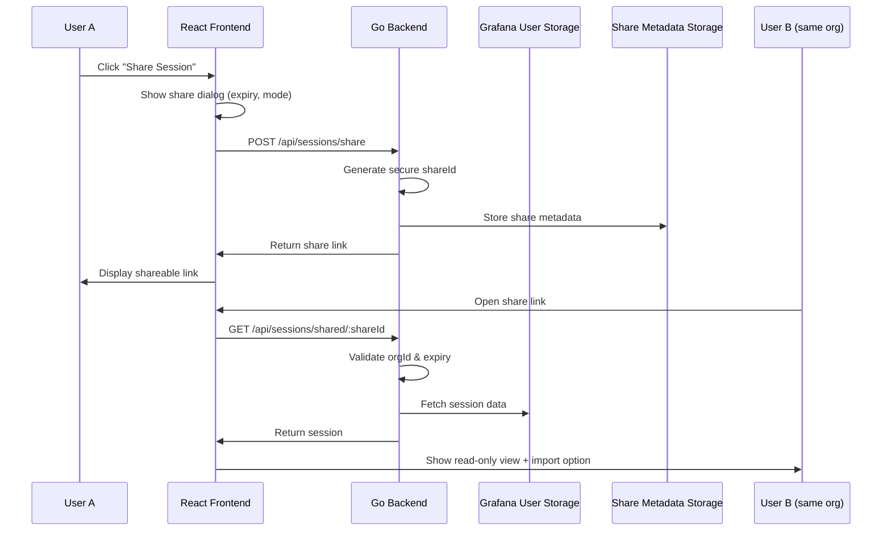

# Session Sharing via HTTP Links

## Overview

Enable users to share chat sessions via HTTP links that can be accessed by other users in the same Grafana organization. Shared sessions support configurable expiration and can be viewed as read-only or imported as a copy.

## Architecture

## Implementation Plan

### 1. Backend: Share Metadata Storage

**File**: `pkg/plugin/shares.go` (new file)

- Create `ShareMetadata` struct with fields:
  - `ShareID` (string) - unique identifier
  - `SessionID` (string) - reference to original session
  - `OrgID` (int64) - organization scope
  - `CreatedBy` (string) - user ID who created share
  - `ExpiresAt` (time.Time) - optional expiration
  - `CreatedAt` (time.Time) - creation timestamp
- In-memory storage with sync.RWMutex (or use Grafana database if available)
- Methods: `CreateShare()`, `GetShare()`, `DeleteShare()`, `CleanupExpired()`

### 2. Backend: API Endpoints

**File**: `pkg/plugin/plugin.go`

Add new routes in `registerRoutes()`:

- `POST /api/sessions/share` - Create shareable link
  - Request body: `{ sessionId, expiresInDays (optional) }`
  - Response: `{ shareId, shareUrl, expiresAt }`
  - Validate user has access to session
  - Generate cryptographically secure shareId (use `crypto/rand`)

- `GET /api/sessions/shared/:shareId` - Retrieve shared session
  - Validate share exists and not expired
  - Validate requester's orgId matches share's orgId
  - Fetch session from user storage (via frontend API or backend storage)
  - Return session data (read-only format)

- `DELETE /api/sessions/share/:shareId` - Revoke share link
  - Validate user owns the share
  - Remove from storage

### 3. Frontend: Share Service

**File**: `src/services/sessionShare.ts` (new file)

- `createShare(sessionId, expiresInDays?)` - Call backend to create share
- `getSharedSession(shareId)` - Fetch shared session
- `revokeShare(shareId)` - Delete share link
- `buildShareUrl(shareId)` - Construct full URL

### 4. Frontend: Share Dialog Component

**File**: `src/components/Chat/components/ShareDialog/ShareDialog.tsx` (new file)

- Form with:
  - Expiry selector (Never, 7 days, 30 days, 90 days, Custom)
  - Share mode info (read-only + copy option)
  - Generated link display with copy button
  - Revoke/share again options
- Use Grafana UI components (`Input`, `Button`, `Select`)

### 5. Frontend: Shared Session View

**File**: `src/pages/SharedSession.tsx` (new file)

- Route: `/shared/:shareId`
- Fetch shared session on mount
- Display session in read-only mode
- Show "Import as New Session" button
- Handle expired/invalid links gracefully
- Show org access error if user not in same org

### 6. Frontend: Integration Points

**File**: `src/components/Chat/components/SessionSidebar/SessionSidebar.tsx`

- Add "Share" button next to each session in the list
- Open ShareDialog when clicked
- Show share indicator icon if session is shared

**File**: `src/components/App/App.tsx`

- Add route: `<Route path="/shared/:shareId" element={<SharedSession />} />`

**File**: `src/components/Chat/Chat.tsx` (if needed)

- Add read-only mode prop to disable input when viewing shared session

### 7. Security Considerations

- Share IDs: Use `crypto/rand` to generate 32-byte random IDs (base64 encoded = ~43 chars)
- Org validation: Always check `orgId` matches in backend
- Expiry cleanup: Background goroutine to remove expired shares (run on plugin init)
- Rate limiting: Limit share creation per user/org
- Input validation: Validate sessionId exists and user has access

### 8. Data Flow

1. **Creating Share**:

   - User clicks "Share" → ShareDialog opens
   - User selects expiry → Frontend calls `POST /api/sessions/share`
   - Backend generates shareId, stores metadata, returns link
   - Frontend displays link with copy button

2. **Accessing Share**:

   - User opens link → Frontend routes to `/shared/:shareId`
   - Frontend calls `GET /api/sessions/shared/:shareId`
   - Backend validates org & expiry, fetches session
   - Frontend displays read-only view with import option

3. **Importing Share**:

   - User clicks "Import" → Frontend calls `sessionService.importSession()`
   - Session is copied to user's account
   - User redirected to their new session

## Files to Create/Modify

### New Files

- `pkg/plugin/shares.go` - Share metadata storage and management
- `src/services/sessionShare.ts` - Frontend share service
- `src/components/Chat/components/ShareDialog/ShareDialog.tsx` - Share dialog UI
- `src/pages/SharedSession.tsx` - Shared session view page

### Modified Files

- `pkg/plugin/plugin.go` - Add share endpoints to `registerRoutes()`
- `src/components/Chat/components/SessionSidebar/SessionSidebar.tsx` - Add share button
- `src/components/App/App.tsx` - Add shared session route
- `src/core/services/SessionService.ts` - Add method to fetch session by ID (if needed for backend)

## Testing Considerations

- Unit tests for share metadata storage
- Integration tests for share creation/retrieval
- E2E tests for share flow (create → access → import)
- Test org isolation (user from different org cannot access)
- Test expiry handling
- Test share revocation

## Future Enhancements (Out of Scope)

- Share analytics (view count, last accessed)
- Password-protected shares
- Share permissions (read-only vs editable)
- Share notifications